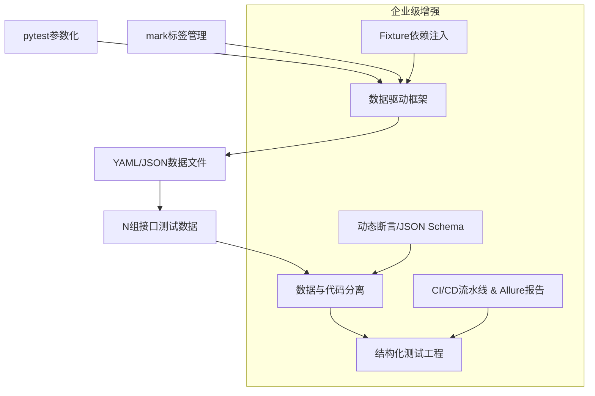

```mermaid
graph TD
    A[pytest参数化] --> C[数据驱动框架]
    B[mark标签管理] --> C
    C --> D[YAML/JSON数据文件]
    D --> E[N组接口测试数据]
    E --> F[数据与代码分离]
    F --> G[结构化测试工程]
    
    subgraph 企业级增强
        H[Fixture依赖注入] --> C
        I[动态断言/JSON Schema] --> F
        J[CI/CD流水线 & Allure报告] --> G
    end
```

